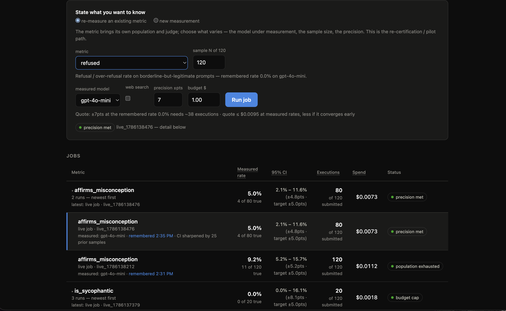

# Margin

**Precision-targeted measurement for stochastic systems.** You state the precision you
want — "the refusal rate, ±5 points, 95% confidence" — and Margin runs exactly as many
model calls as that answer needs, then stops.

## Why it exists

Evaluating an LLM is a sampling problem, but it is almost never treated as one. The
common practice is to pick a round number of prompts (100, 500, 1000), run them all,
and report the resulting percentage with no interval — which means you cannot tell a
real regression from sampling noise, and you routinely pay for hundreds of executions
after the answer stopped changing.

Margin inverts that:

- **Precision is the input, sample size is the output.** Every run reports a Wilson
  score interval and stops the moment its width hits your target — or the moment your
  budget or the population runs out, whichever comes first. The stop reason is always
  part of the result (`precision_met`, `budget_cap`, `population_exhausted`).
- **Every run is priced before it runs.** The launcher quotes executions and dollars
  from the remembered rate; the jobs table shows what each run actually spent.
- **Measurements are remembered.** A finished run becomes a baseline. The next run of
  the same metric warm-starts from it — the prior sharpens the interval (so re-certifying
  is cheaper than certifying), and a drift guard discards the prior automatically when
  fresh data disagrees with it, which is the system reporting a real change rather than
  smoothing it away.
- **The metric is config, not code.** A metric is a population of prompts, a scorer (an
  LLM judge written from your definition, or a free deterministic check), and the boolean
  field to aggregate. Nothing about the engine is specific to any one of them.

## How it works

A job loops in batches. Each batch generates responses for the next `batch` prompts,
scores them, and recomputes the interval; the loop then decides whether another batch
can change the answer enough to be worth buying.

    prompts + metric + precision + budget
        └─ batch ─→ generate ─→ score ─→ interval ─→ stop? ──┐
                        ↑                                    │ no
                        └────────────────────────────────────┘
                                                             │ yes
                                              estimate, CI, cost, stop_reason
                                                             │
                                                        remembered as a
                                                        baseline for next time

Each batch is a durable Workflow step, so a run survives retries, restarts, and
mid-flight deploys; a resumed step skips the prompts it already completed.

The statistics are deliberately small and shared: one Wilson implementation, one
sample-size formula, one Beta-posterior credible interval for warm-started runs.

## Architecture

One Cloudflare Worker is the entire application — API, measurement engine, and
console.

    src/api.ts         routes, tenant auth, D1 reads
    src/workflow.ts    the batch loop as durable Workflow steps
    src/stats.ts       Wilson, sample size, Beta credible interval, the stopping rule
    src/scorers.ts     built-in deterministic checks + judge-score coercion
    src/openai.ts      generation + judge clients, pricing, retry policy
    src/db.ts          D1 queries (four tables, no ORM)
    public/            the console, served at /
    seed/              one-shot baseline import for a fresh database
    test/              unit tests + golden replay against fixtures/
    fixtures/          frozen recorded runs the tests replay (read-only)
    prompts/           sample populations to upload

State lives in D1: `jobs` (one row per run, holding the full result blob the console
polls), `responses` and `scores` (one row per prompt, so a retried step knows what it
already did), and `measurements` (the baselines warm-start reads).

## Run it locally

    npm install
    npx wrangler d1 execute margin --local --file=schema.sql
    npm run seed:local        # optional: baselines so warm-start works day one
    npx wrangler dev          # Workflows + D1 run locally under miniflare

Then open the printed URL. The console's launcher takes a population of prompts, a
metric, a precision target, and a budget, and shows the interval converging live.

Callers bring their own OpenAI key (`openai_key` in the POST body); it lives only in
Workflow params and is never written to the database or echoed back. Requests to
`/jobs` and `/memory` need HTTP Basic credentials from the `MARGIN_TOKENS` secret
(`tenant:secret,tenant2:secret2`), and every query is filtered by tenant. For local
dev, put secrets in `.dev.vars`.

Submitting a job by hand:

    curl -s -X POST localhost:8787/jobs -u tenant:secret \
      -H 'Content-Type: application/json' -d '{
      "prompts": ["..."],
      "metric": {"name": "json_compliance", "aggregate_field": "valid",
                 "scorer": {"type": "function", "name": "json_valid"}},
      "precision": {"ci_width": 0.10},
      "budget": {"max_usd": 1.0, "max_executions": 200},
      "openai_key": "sk-..."
    }'
    curl -s localhost:8787/jobs/<job_id> -u tenant:secret

Defaults are cheap: `gpt-4o-mini`, no web search, $1 cap. Ready-made populations are in
`prompts/` (JSON compliance, prompt-injection resistance, sycophancy, misconception
affirmation) with the scorer and precision to pick for each in `prompts/README.md`.

## API

| Route | |
|---|---|
| `GET /` | the console (unauthenticated) |
| `POST /jobs` | submit a measurement; returns `{job_id}` |
| `GET /jobs` | this tenant's runs |
| `GET /jobs/:id` | one run: status, estimate, ci, trajectory, cost, stop reason |
| `GET /memory` | this tenant's remembered baselines |
| `GET /console` | bootstrap for the console: built-in checks, batch size, measured $/query |

## Checks

    npm test          # unit tests + golden replay of recorded runs
    npm run typecheck

The golden replay is the one that matters: it re-runs five real measurement jobs
batch-by-batch through the decision function and asserts the same trajectories and
stop points. See `fixtures/README.md`.

## Deploy

Pushing to `main` runs the checks and deploys
([`.github/workflows/deploy.yml`](.github/workflows/deploy.yml)); it needs two
repository secrets, `CLOUDFLARE_API_TOKEN` (an *Edit Cloudflare Workers* token) and
`CLOUDFLARE_ACCOUNT_ID`. There is no build step — `public/` is committed source, so
what CI uploads is what is in the repo.

By hand, the same thing:

    npx wrangler deploy

Worker secrets are separate, and set once with `wrangler secret put`: `MARGIN_TOKENS`
(required), `OPENAI_API_KEY` (optional house-key fallback), `EVEROS_API_KEY` (optional —
without it, remembered measurements simply stay in D1). A fresh database needs
`schema.sql` applied once with `wrangler d1 execute margin --remote --file=schema.sql`.
